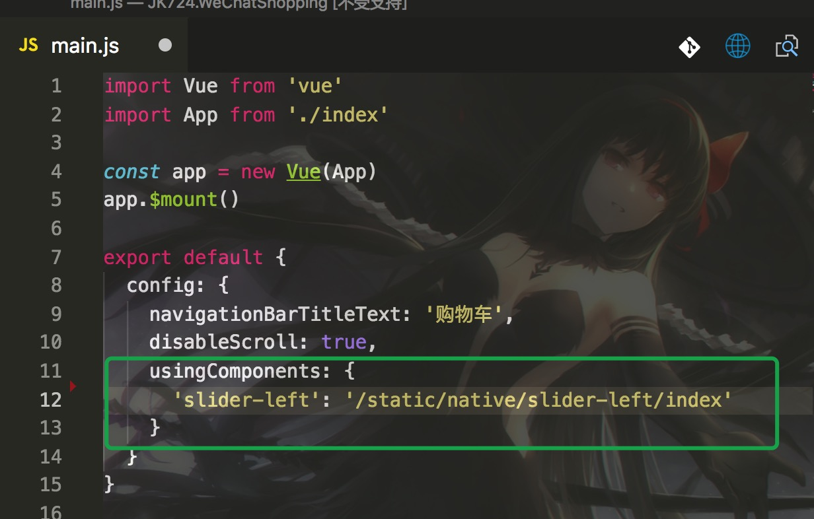

# minapp-slider-left 
微信小程序左划删除组件，可能是性能最好、实现最简单的方案，使用官方组件movable-area、cover-view实现


## 使用指南
在 小程序页面对应的 json配置中引入组件
```json
{
 "usingComponents": {
  "slider-left": "路径组件/slider-left/index"
 }
}
```
即可在页面中任意位置使用：
```html
<slider-left>hello word</slider-left>
```
### 具体参数和事件
#### 参数说明
| 参数       | 说明      | 类型       | 默认值       | 必须      |
|-----------|-----------|-----------|-------------|-------------|
| moveThreshold | 阈值，往左移动超过则显示删除按钮，否则隐藏（一般为删除按钮宽的40%）；单位px | Number | 30 | NO|
| openWidth | 可以往左拖动的最大距离,或者说是删除按钮的宽度(单位: px) | Number | 75 |NO |
| open | 是否打开，true表示打开，false表示关闭;该组件有两种状态，左滑显示删除按钮时表示打开，反之关闭;通过修改该属性可以关闭或者打开组件 | Boolean | false | NO|
#### 事件说明
| 事件名       | 说明      | 参数       |
|-----------|-----------|-----------|
| change | 组件状态变更后会触发 | open  变更后的组件状态 |
| delete | 点击删除按钮会触发 |  |
| sliderLeftStart | 如果组件当前是关闭状态，开始左滑时触发（轻触摸的时候也会触发），主要用于显示当前删除按钮前先 隐藏掉其它项的删除按钮 |  |

### 原生小程序中使用
本组件就是用官方提供的组件API开发的，没有任何依赖，参照代码片段中的使用方式使用即可
### [mpvue](https://github.com/Meituan-Dianping/mpvue)中使用
- 首先在mpvue项目中的static目录下，新建一个文件夹native，表示这里放原生小程序编写的组件,放在static里的东西会被直接拷贝到dist/static目录
- 将本库中components下的slider-left文件夹拷贝到native文件夹下
- 在需要使用该组件的页面对应的main.js里面，配置组件名和路径：

- 在页面中即可通过使用`<slider-left></slider-left>`标签来使用本组件了

ps:  由于mpvue目前对 [Slot scoped](http://mpvue.com/mpvue/#vue_1)不支持，所以用mpvue的编写的vue组件是无法在循环中使用组件的，所以这里还是用小程序官方提供的组件编写方式来编写，这样在任何第三方脚手架里均可使用;

## 预览
+ 已经使用在线上项目，全程基本稳定在60fps,线上项目预览效果：


+ 你也可以复制下面的小程序代码片段地址,打开微信开发工具,导入代码片段，即可查看效果
```
wechatide://minicode/fuwFLLmd7DLb
```

## TODO
- [x] `实现原理解析`
